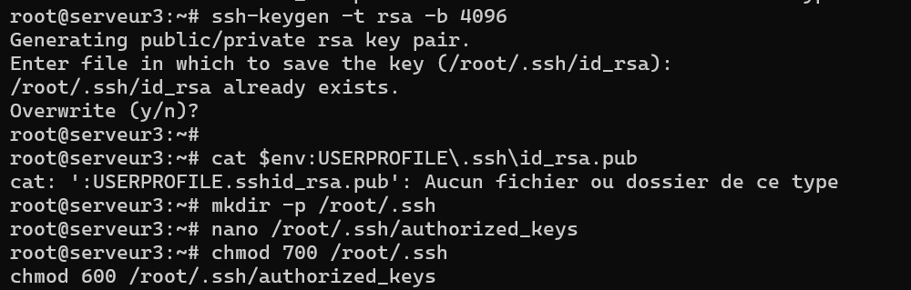
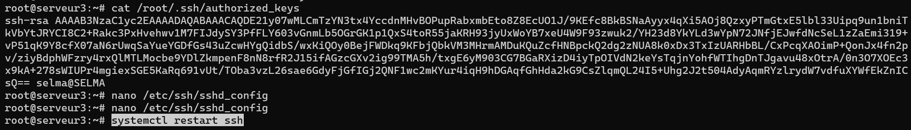

# TP2-ssh-unix

# TP 02 : Services, processus et signaux (SSH)


**Étudiante :** SAHRAOUI Selma
**Formation :** LP Projet Web et Mobile 
**Enseignant :** M. Le Cocq

---

## 1. Secure Shell : SSH

L'objectif de ce TP est de sécuriser l'accès à notre serveur en remplaçant l'authentification par mot de passe par un mécanisme de clés cryptographiques (publique/privée).

### 1.1 Connexion SSH Root

Dans la continuité du TP précédente, le serveur OpenSSH était installé (`apt install openssh-server`) et configuré l'accès initial pour l'utilisateur root.

**Analyse de la configuration (`man sshd_config`) :**
Pour autoriser la connexion, j'ai modifié la directive `PermitRootLogin`. Voici les différentes options possibles et leur utilité :

* **`yes`** : Autorise la connexion root avec un mot de passe.
    * *Avantage :* Simple pour la première installation selon moi.
    * *Inconvénient :* **Dangereux**. Très vulnérable aux attaques par force brute..
* **`prohibit-password` (ou `without-password`)** : Autorise root mais uniquement via des clés SSH.
    * *Avantage :* Très sécurisé (standard recommandé).
    * *Cas d'usage :* Serveurs de production automatisés.
* **`no`** : Interdit totalement l'accès distant à root. (svm)
    * *Avantage :* Sécurité maximale (oblige à se connecter en utilisateur normal puis utiliser `su`).

*Choix initial :* J'ai utilisé `yes` temporairement pour configurer la machine, avant de passer à une méthode plus sûre.

---

### 1.2 Génération de clés (Côté Hôte)

Travaillant depuis une machine hôte **Windows**, j'ai utilisé l'invite de commande PowerShell pour générer ma paire de clés.

**Commande utilisée :**
```powershell
ssh-keygen -t rsa -b 4096

```

-   **\-t rsa :** Choix de l'algorithme RSA (robuste).
-   **\-b 4096 :** Taille de la clé en bits (4096 est le standard actuel de sécurité haute).

Les clés ont été sauvegardées dans `C:\Users\selma\.ssh\`.

**Note sur la "Passphrase" :** Pour les besoins du TP, je n'ai pas défini de phrase de passe (passphrase).

-   _Pourquoi c'est risqué :_ Si un attaquant vole mon fichier de clé privée (`id_rsa`) sur mon ordinateur, il peut se connecter au serveur sans aucune barrière.
-   _Bonne pratique :_ Une passphrase agit comme une double sécurité (chiffrement de la clé). Même volée, la clé est inutilisable sans le code.

  






### 1.3 Authentification par clé : Mise en place sur le serveur

  

Pour que le serveur m'accepte, j'ai dû transférer ma **clé publique** (`id_rsa.pub`) vers le fichier des clés autorisées du serveur.

**Procédure réalisée :**

1.  **Sur Windows :** J'ai affiché et copié le contenu de ma clé publique via la commande `type C:\Users\selma\.ssh\id_rsa.pub`.
2.  **Sur le Serveur (Linux) :** J'ai collé cette clé dans le fichier `/root/.ssh/authorized_keys` via l'éditeur `nano`.

**Sécurisation des permissions (Crucial) :** SSH refuse l'authentification si les fichiers sont trop ouverts (accessibles aux autres utilisateurs). J'ai donc appliqué les droits stricts suivants :


mkdir -p /root/.ssh
chmod 700 /root/.ssh                  # (rwx------) Seul root peut entrer dans le dossier
chmod 600 /root/.ssh/authorized\_keys  # (rw-------) Seul root peut lire/écrire le fichier

###   

### 1.4 Test de connexion depuis la machine hôte

J'ai vérifié le fonctionnement en me connectant depuis Windows en spécifiant explicitement ma clé privée avec l'option `-i`.

**Commande :**

**PowerShell**
ssh -i C:\\Users\\selma\\.ssh\\id\_rsa root@localhost -p 2222

**Résultat :** La connexion s'établit immédiatement sans demande de mot de passe. L'authentification par clé est fonctionnelle.

  

### 1.5 Sécurisation Avancée

Maintenant que l'accès par clé fonctionne, il est impératif de désactiver l'authentification par mot de passe pour verrouiller le serveur.

**1\. Procédure de verrouillage** J'ai modifié le fichier `/etc/ssh/sshd_config` sur le serveur :

-   Avant : `PermitRootLogin yes`
-   **Après :** `PermitRootLogin prohibit-password`

J'ai ensuite redémarré le service avec `systemctl restart ssh`. Désormais, seul le détenteur de la clé privée peut se connecter.

**2\. Les attaques "Brute-Force"** Une attaque par force brute consiste à utiliser un robot qui teste des milliers de mots de passe à la seconde (dictionnaire, combinaisons...) jusqu'à trouver le bon.

-   _Pourquoi la clé protège :_ Une clé RSA 4096 bits est mathématiquement trop complexe pour être devinée. Désactiver les mots de passe rend donc ces attaques inefficaces.

**3\. Autres techniques de protection** Pour un serveur exposé sur Internet, d'autres mesures sont recommandées :

  

-   **Fail2Ban :**

  

-   _Principe :_ Analyse les logs en temps réel et bannit l'adresse IP (via le pare-feu) après X tentatives de connexion échouées.
-   _Avantage :_ Bloque les tentatives de scan automatique.

  

-   **Changement de port (ex: 2222) :**

  

-   _Principe :_ "Sécurité par l'obscurité".
-   _Avantage :_ Évite le "bruit" des robots qui ne scannent que le port standard 22, bien que cela n'arrête pas une attaque ciblée.

  

-   **Utilisateur dédié (Non-root) :**

  

-   _Principe :_ Interdire `root` (`PermitRootLogin no`) et utiliser un utilisateur normal avec `sudo`.
-   _Avantage :_ Traçabilité des actions et limitation des dégâts si le compte est compromis.

**Sources consultées :** \* Documentation Debian - SSH Server Configuration. \* ANSSI - Recommandations pour un usage sécurisé d'OpenSSH. \* Manuel officiel (`man sshd_config`).
